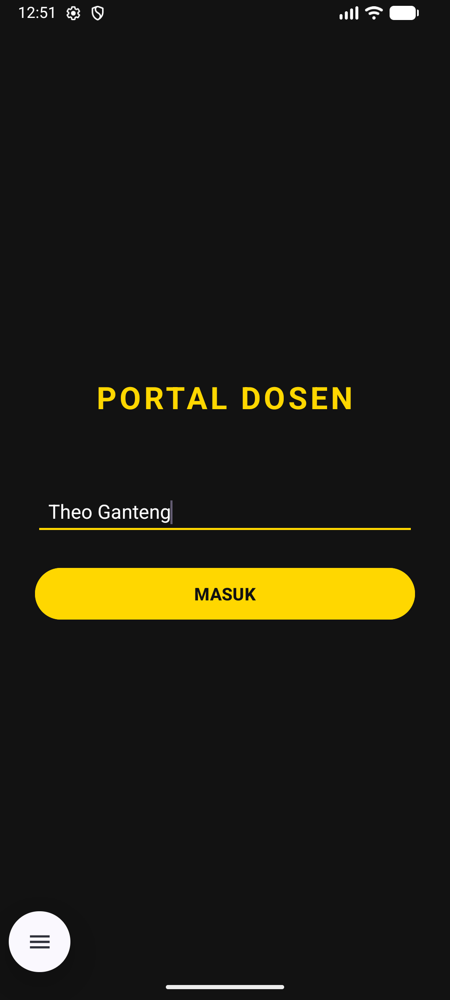
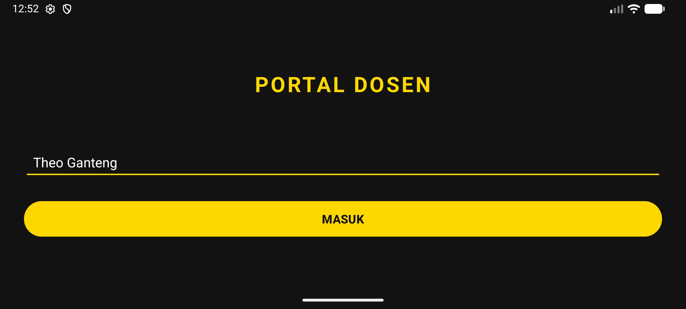
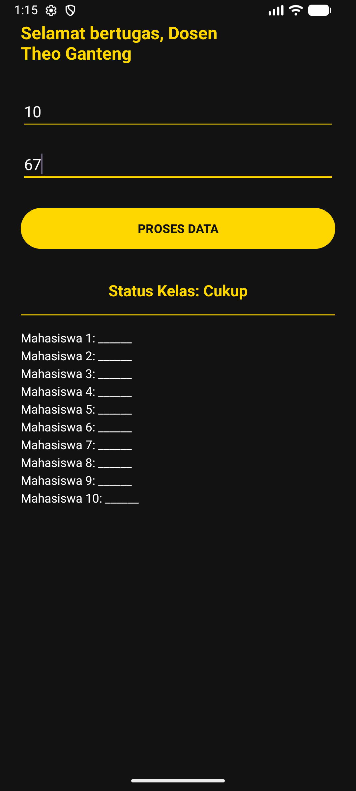
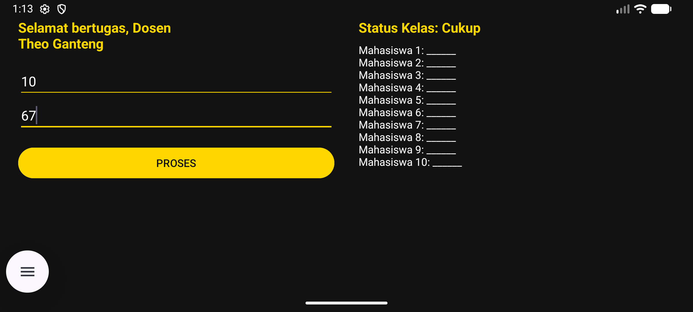

# UTS Pemrograman Seluler - Aplikasi Generator Lembar Penilaian

## Identitas Mahasiswa
- **Nama Lengkap:** I Nyoman Theo Ardiles Rada
- **NIM:** 42430018
- **Program Studi:** Teknologi Informasi

## Deskripsi Aplikasi
Aplikasi ini dibangun untuk memenuhi Ujian Tengah Semester (UTS) mata kuliah Pemrograman Seluler. Aplikasi ini mendemonstrasikan penguasaan materi paruh pertama semester, meliputi:
1. **Modul 2 & 3:** Desain UI/UX bertema *Dark & Gold* dan penerapan Layout Responsif (beradaptasi saat *Portrait* dan *Landscape* menggunakan folder `layout-land`).
2. **Modul 4:** Navigasi multi-layar dan *Data Passing* menggunakan `Intent` (Mengirim data input dosen ke halaman panel).
3. **Modul 5:** Implementasi *Control Flow*:
    - Menggunakan percabangan `If-Else` untuk menentukan status kelas berdasarkan rata-rata nilai.
    - Menggunakan perulangan `For Loop` untuk mencetak daftar absen/lembar penilaian secara otomatis sesuai jumlah mahasiswa.

## Screenshot Aplikasi
*(Catatan: Unggah foto screenshot kamu ke folder proyek di GitHub, lalu ganti link di bawah ini dengan nama filenya)*

### 1. Halaman Login (Responsif)
|             Mode Portrait              |             Mode Landscape              |
|:--------------------------------------:|:---------------------------------------:|
|  |  |

### 2. Halaman Panel Generator
|            Mode Portrait            |            Mode Landscape            |
|:-----------------------------------:|:------------------------------------:|
|  |  |